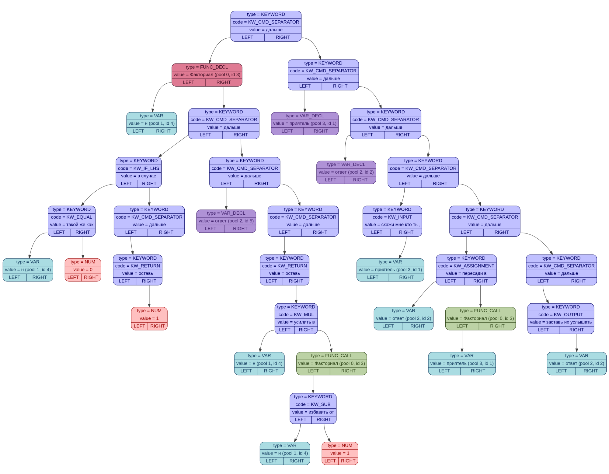
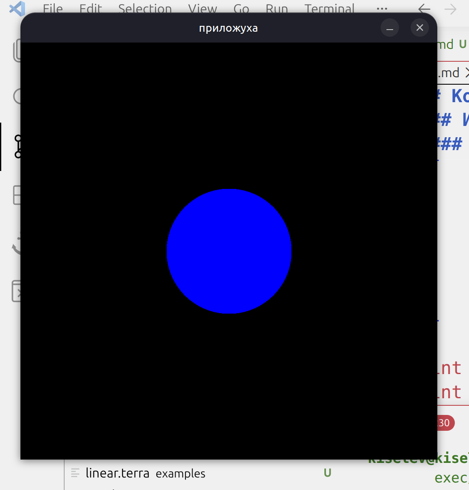

# Компилятор языка TerraLang

## Описание:

Компилятор моего C-подобного языка TerraLang в перемещаемый ELF-файл под архитектуру x86-64.

## Использование
```bash
    ./driver.sh <имя_файла>
```

----

#### Например, команда
```bash
    ./driver.sh fib
```

Автоматически запустит:

##### frontend, переводящий исходный файл в *AST* (Abstract Syntax Tree):
```bash
    ./front examples/fib.terra
```

<p align="center">
    
</p>


##### backend, переводящий AST в объектный ELF-файл, а также ассемблерный файл на *nasm*:
```bash
    ./back ast/fib.txt
```

##### Компиляцию библиотеки *lib.c*.

##### Линковку получившихся объектных файлов.

Выходные исполняемые файлы находятся в директории **exec**.

Также в папке **asm** находятся скомпилированные файлы в ассемблер *nasm*.

Запуск получившегося исполняемого файла: 
```bash
    ./exec/fib
```

---

### Пример программы, считающей факториал:

```
босс Факториал для призыва нужны: н
    ПРИЗЫВ ПРИЗЫВ ПРИЗЫВ

    в случае н такой же как 0 свершится
    ВХОД ВХОД ВХОД ВХОД ВХОД

        оставь 1 дальше

    ВЫХОД ВЫХОД ВЫХОД ВЫХОД
    дальше

    моб ответ дальше

    оставь н усилить в вызови Факториал с жертвой (н избавить от 1) дальше

    КОНЕЦ?

дальше

моб приятель дальше
моб ответ    дальше

скажи мне кто ты, приятель дальше

пересади в ответ вызови Факториал с жертвой приятель дальше

заставь их услышать ответ дальше
```

### Эквивалент программы на C

```cpp
int ComputeFactorial(int n)
{
    if (n == 0)
    {
        return 1;
    }

    return n * ComputeFactorial(n - 1);
}

int n;
int res;

scanf("%d", &n);

res = ComputeFactorial(n);

printf("%d", res);

```

### Графика

В языке присутствует поддержка графики с помощью библиотеки SDL.
Пример исходного файла [**circle_sdl.terra**](examples/circle_sdl.terra), рисующего кружок. Размер и цвет задаются из командной строки.

<p align="center">
    
</p>

### Грамматика

Дополнительно описана [грамматика в расширенной форме Бэкуса — Наура](grammar.md).

## Источники
[<u>Intel manual ISA</u>](https://www.intel.com/content/www/us/en/developer/articles/technical/intel-sdm.html)<br>
[<u>WikiOSDev page about Intruction Encoding</u>](https://wiki.osdev.org/X86-64_Instruction_Encoding)<br>
[<u>WikiOSDev page about ELF format</u>](https://wiki.osdev.org/ELF)<br>
[<u>man page about ELF format</u>](https://man7.org/linux/man-pages/man5/elf.5.html)<br>
[<u>LinuxFoundation about ELF</u>](https://refspecs.linuxfoundation.org/elf/gabi4+/contents.html)
